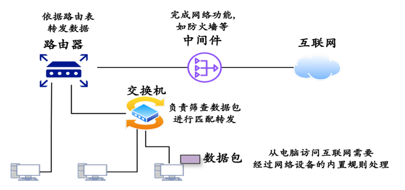

# 第1章：NPC语言

在现代数字基础设施中，海量数据在光纤网络中进行着持续的高速传输，如图1所示。长期以来，数据包的处理与转发逻辑被固化在网络设备的专用硬件电路中，难以通过软件进行灵活定义。NPC++ 的出现打破了这一壁垒。作为华为专为自研网络设备数据平面打造的编程语言，它赋予了开发者在纳秒级时间尺度上直接操控每一个数据包的能力，是构建下一代智能网络架构的关键钥匙。

                                            图1   网络设备中的数据包处理路径与规则匹配机制  

## 1. 网络设备与其核心使命

在互联网的基础设施中，光纤构成了物理通道，而网络设备则是通道上的关卡。无论是负责局域网数据交换的交换机（Switch）、规划跨网路径的路由器（Router），还是执行安全检查与负载均衡的中间件（Middlebox），这些专用硬件设备本质上都在执行同一个核心任务：数据包处理（Packet Processing）。**图1展示了数据包从终端出发访问互联网的典型路径。** 当数据包离开源主机后，需依次经过交换机、路由器和中间件等网络设备的处理。虽然这些设备的角色不同——交换机负责局域网内的筛选与二层转发，路由器依据路由表进行跨网三层转发，中间件（如防火墙）则执行特定的安全策略。但它们在**数据平面**的工作逻辑是相通的：即解析数据包首部，匹配设备内置的规则表项，并执行相应的转发或丢弃动作。

每秒钟，数以亿计的数据包流经这些设备。设备必须在瞬间查看数据包头部信息，依据内置规则决定是转发、修改还是丢弃。在过去，这种处理逻辑被固化在 ASIC 芯片中，被称为“固定功能”硬件。这种模式虽然保证了早期的处理速度，但在云计算和 AI 时代，它导致了严重的问题：新协议的支持往往需要更换硬件，定制化需求无法满足，且故障发生时设备如同“黑盒”般不可观测。**面对这种日益严峻的供需矛盾，网络架构迫切需要一次从底层逻辑上的重构。正是在这种背景下，数据面编程（Data Plane Programming）应运而生。** 

## 2. 从“黑盒”到“可编程”

**数据面编程**是指开发者通过高级编程语言（如 P4），直接对网络设备转发芯片（ASIC、FPGA 或 NPU）的数据包处理逻辑进行定义和修改的技术。数据面编程的兴起，标志着网络设备从“功能机”向“智能手机”的进化。这里所说的编程并非指传统的命令行配置，而是指开发者可以通过代码直接定义芯片处理数据包的行为。

这种变革带来了三大优势：**功能的软件化定义**让新协议支持只需一次固件更新；**极速的创新周期**允许在现有硬件上快速验证新算法；而全网可观测性（Telemetry）则让设备能够主动上报数据包的排队与路径信息，让运维变得前所未有的透明。随着芯片工艺的进步，可编程交换芯片的性能已媲美固定功能芯片，这为 NPC++ 的诞生提供了物理基础。表1给出了传统数据面和可编程数据面的区别。

                                       表1 传统数据面和可编程数据面的区别

| 维度 | 传统数据面 | 可编程数据面 |
| --- | --- | --- |
| 协议支持 | 出厂固化，支持标准协议 | 可编程定义，支持自定义协议 |
| 升级方式 | 更换硬件 | 重新编译并加载软件代码 |
| 开发者角色 | 填表者 | 造表者 |
| 典型代表 | 传统 ASIC 交换机 | P4 交换机, 智能网卡 |

## 3. 架构基础：控制与转发的分离

理解 NPC++ 前，必须厘清现代网络设备的二元架构：

- **控制平面**：运行在通用 CPU 上，负责复杂的逻辑决策（如路由路径计算、策略制定），处理频率较低但逻辑复杂。
- **数据平面**：运行在专用网络芯片（NP/ASIC）上，负责根据控制面的指令，对海量数据包进行极低延迟的线速转发。

**NPC++ 正是运行在数据平面上的语言**。

## 4. 为什么选择 NPC++？

在数据面编程领域，业界曾尝试过多种方案，但都存在“不可能三角”的困局：**微码（Microcode）虽然性能极致但开发难度极高且不可移植；P4 语言虽然实现了硬件无关的标准，但因非图灵完备且抽象层过高，难以处理复杂有状态业务，也无法充分挖掘特定硬件的加速特性；而厂商私有 C 语言**则面临严重的“方言化”和内存安全风险。

**NPC++ 是华为为了打破这一困局而设计的答案。**它融合了高级语言的易用性与底层硬件的高效性，专门针对华为网络处理器（NP）架构进行了深度优化。与 P4 相比，NPC++ 具备**图灵完备**的表达力，能够描述应用层重组、动态连接跟踪等复杂逻辑；同时，编译器能将代码智能映射到华为芯片的多核并行流水线上，调用专用的硬件加速引擎，从而在保持开发灵活性的同时，实现线速处理能力。

## 5. NPC++ 语言机制概览

NPC++ 采用了一套简洁而强大的抽象模型来描述报文处理逻辑。不同于传统编程，它将处理流程高度抽象化：

开发者首先定义**解析器来提取报文中的协议头（如 Eth、IP、TCP 或私有协议）；接着配置匹配-动作表**，以“匹配 Key -> 执行 Action”的方式定义业务规则（例如匹配源 IP 进行转发或丢弃）；最后通过控制流将这些表组织成有向无环图，从而构建出完整的报文处理管线。这种设计配合元数据（Metadata）机制，使得状态信息可以在处理阶段间高效传递；而配套的 **NDI（NP Driver Interface）** 则作为控制面与数据面的桥梁，允许运行时动态下发规则，实现了软硬件的完美协同。

## 6. 应用前景

作为华为可编程网络生态的核心工具，NPC++ 已被广泛应用于**可编程交换机**、智能网卡**以及**网络功能虚拟化场景中。无论是数据中心的拥塞控制算法、还是毫秒级的安全防御策略，NPC++ 都在底层支撑着这些高性能业务的运转，推动着网络基础设施向智能化方向演进。