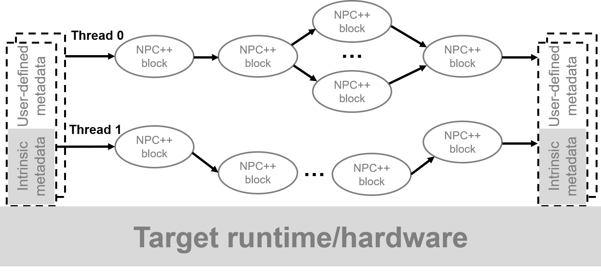

# 第2章：数据包处理实例（hello world 现在例子更复杂）



上图为完整的数据报文处理流程图。报文从左侧进入交换机硬件 。接着被解析成多个头部字段，包括以太网，ipv4等。通过元数据metadata获取报文头部所携带的信息，接着进入到线程thread内处理报文，处理过程为将元数据和头部字段通过多个block（包括table+function以及control函数），处理完成后重新组合字段构建数据包发送，元数据被丢弃。

最下方的target runtime和hardware为硬件资源，即上面的数据报文处理程序是数据面的体现。下面是控制面和硬件资源。

在深入了解语法细节之前，我们先通过一个经典的“三层转发”实例，来完整体验一次 NPC++ 的开发流程。本章将采用**代码拆解**的方式，一步步剖析如何在数据平面实现从报文接收、解析、查表到转发的完整逻辑。

做流统计  流分类  或者仅仅只是把端口的报文做个镜像  发到另一个机器上做一些解析 或者流分析。

### **2.1 核心实例：构建基础三层转发器 (npc_test)**

**场景假设**：

我们需要在一台拥有8个以太网端口的交换机上实现基础的 IPv4 路由转发功能。

**处理逻辑**：

1. **解析**：提取报文的 Ethernet 和 IPv4 头部。
2. **检查**：检查报文的目的 MAC 是否匹配本机（IPAT表），若不匹配则丢弃。
3. **路由**：根据目的 IP 查找路由表（FIB表），获取出端口和下一跳信息。
4. **封装**：修改报文的源/目的 MAC 地址。
5. **转发**：将报文从指定出端口发送出去。

### 第一步：定义报文头格式 (Header Definition)

数据面编程的第一步是告诉芯片“报文长什么样”。我们利用 struct 和 typedef 定义数据结构。

> 注意：NPC++ 使用 uint<N> 来精确控制位宽，例如 uint<48> 对应 6 字节的 MAC 地址。
> 

```cpp
//首先是头文件模块
//注意以太网地址是48字节，ipv4地址是32字节
//利用typedef 自定义名称 IPV4_ADDR_T
typedef uint<48> MAC_ADDR_T;
typedef uint<32> IPV4_ADDR_T;
struct ETHER_HDR_S {
    MAC_ADDR_T DstMac; 
    MAC_ADDR_T SrcMac;
    uint<16> EtherType;
};
#define ETHERTYPE_IPV4 0x0800
struct IPV4_HDR_S {
    uint<4>  Version;
    uint<4>  Ihl;
    uint<8>  Tos;
    uint<16> TotalLen;
    uint<16> Id;
    uint<1>  FlagR;
    uint<1>  FlagDF;
    uint<1>  FlagMF;
    uint<13> FrgOffset;
    uint<8>  Ttl;
    uint<8>  Protocal;
    uint<16> Checksum;
    IPV4_ADDR_T Sip;
    IPV4_ADDR_T Dip;
};
NPCHeader <ETHER_HDR_S>  ethHdr;  //通过NPCHeader把声明的结构体具体化一个实例ethHdr
NPCHeader <IPV4_HDR_S>   ipv4Hdr;
```

### 第二步：编写解析器 (Parser)

解析器是一个有限状态机，负责从比特流中提取字段。@parser 关键字标识了这是解析逻辑。

```cpp
//其次是解析器模块，解析以太头和ipv4头，属于两个C函数，注意前面表明该功能是@parser

@parser void ParseEthernet()  //解析提取以太网头部
{
    _extract(ethHdr);
    return switch(ethHdr.EtherType)
    {
        case ETHERTYPE_IPV4:
            ParseIpv4;
        default:
            accept;
    }
}

@parser void ParseIpv4() //解析提取ipv4头部
{
    _extract(ipv4Hdr);
    return accept;
}
```

### 第三步：定义匹配-动作表 (Tables & Actions)

这是数据面的核心业务逻辑。我们需要定义三张表：

1. **IPAT (Ingress Port Associate Table)**：入端口关联表，用于验证目的 MAC。
2. **FIB (Forwarding Information Base)**：路由表，用于查找目的 IP 对应的出端口。
3. **EPAT (Egress Port Associate Table)**：出端口关联表，用于获取发包时的源 MAC。

```cpp
//接着声明匹配表模块，当数据包内的某些字段与表项匹配，则进行相应的action
#define TBL_SIZE_8BIT 8
#define FIBV4_SIZE 8
table IPAT_TBL()
{
    key = {
        g_ctrlMd.InChnnl: exact;
    }
    IPAT_RSP_S _lookup();
    actions = {
        _lookup: no_action; //不执行额外操作
    }
    size = TBL_SIZE_8BIT;
}

table FIBV4_TBL()
{
    key = {
        g_flowKey.VrfId: lpm;
        g_flowKey.Dip: lpm;
    }
    STATUS_T _status();
    LPM_RSP_S _lookup();
    actions = {
        _lookup: Fibv4Proc(); //匹配成功后执行相应的action
    }
    size = FIBV4_SIZE;
}
//Fibv4Proc是上面FIBV_TBL对应表项匹配成功后执行的action操作
void Fibv4Proc(STATUS_T sta, LPM_RSP_S rsp)
{
    g_ctrlMd.OpStatus = sta;
    g_ctrlMd.LinearIndex = rsp.idx;
}

table EPAT_TBL()
{
    key = {
        g_ctrlMd.OutChnnl: exact;
    }
    EPAT_RSP_S _lookup();
    actions = {
        _lookup: no_action;
    }
    size = TBL_SIZE_8BIT;
}
```

### 第四步：构建控制流

控制流将上述组件串联起来，形成完整的处理管线。

```cpp
//最后是控制流模块，解析完数据包后，通过如下流程实现整体上的数据包匹配和发送操作
//声明一些全局变量
struct CTRL_META_DATA_S{
		uint<8> OpStatus;//状态
		uint<8> LinearIndex; //索引
		uint<8> InChnnl; //入端口
		uint<8> OutChnnl; //出端口
};
struct FLOW_KEY_S{
		uint<8> VrfId; //找到匹配的索引
		uint<32> Dip; //目的ip
};
struct IPAT_RSP_S{
		uint<48> Mac; //目的MAC地址
		uint<8> VrfId; //找到匹配的索引
};
struct LPM_RSP_S{
    uint<8> idx; //找到匹配的索引
		uint<48> DstMac; //目的MAC地址	
};
struct EPAT_RSP_S{
    uint<8> idx; //找到匹配的索引
		uint<48> Mac; //目的MAC地址	
};

CTRL_META_DATA_S   g_ctrlMd;
FLOW_KEY_S  g_flowKey;

IPAT_TBL ipat;  //这个是声明的table
FIBV4_TBL fibv4; // 这个是声明的table
EPAT_TBL epat; //这个是声明的table

@control void ControlFlow()
{
    g_ctrlMd.InChnnl = npc_intrinsic_metadata.InSubChan[7:0];
    //匹配表项，查找目的mac地址，如果mac地址不对，则丢弃
    //IPAT_RSP_S 这个代表要写入的内容，即匹配成功后将内容写入到对应变量，后续带RSP_S的均为写入
    IPAT_RSP_S ipatRsp = ipat._lookup();
    if (ipatRsp.Mac[47:32] != ethHdr.DstMac[47:32] || ipatRsp.Mac[31:0] != ethHdr.DstMac[31:0]) {
        npc_pkt_drop();
        npc_exit();
    }
    //获取匹配到的VrfId和Dip，接着匹配
    g_flowKey.VrfId = ipatRsp.VrfId;
    g_flowKey.Dip = ipv4Hdr.Dip;
    
    //如果匹配成功，获取出端口 
    LPM_RSP_S rsp = fibv4._lookup();
    g_ctrlMd.OutChnnl = rsp.idx;
    
    //依照出端口获取到对应的mac地址
    EPAT_RSP_S epatRsp = epat._lookup();
    
    //重新封装数据包的mac地址
    ethHdr.DstMac = rsp.DstMac;
    ethHdr.SrcMac = epatRsp.Mac;
    //发送数据包
    npc_pkt_add_sys_hdr();
    npc_pkt_deparser();
    npc_pkt_send();
    npc_exit();
}

NPCProgram(ParseEthernet(), ControlFlow()) main;
```

## 2.2 编译与工具链

完成代码编写后，我们需要使用华为提供的编译器 icomp 将 NPC++ 源码编译为硬件可执行的二进制文件。

### 1. 工具安装

确保 icomp 编译器文件已上传至开发环境（如 Ubuntu 系统）。

### 2. 编译命令

在终端中执行以下命令进行赋权和编译：

```jsx
# 赋予编译器执行权限
chmod 777 icomp 

# 编译 npc_test.npc 文件 (假设源码文件名为 npc_test.npc)
# 输出结果通常包含二进制固件及相关日志
./icomp npc_test.npc
```

## 2.3 测试环境搭建

（此处预留测试代码位置，通常涉及使用发包工具如 Scapy 或 TCPreplay 向模拟端口发送数据包，并验证出端口捕获的报文 MAC 地址是否已被正确修改。）