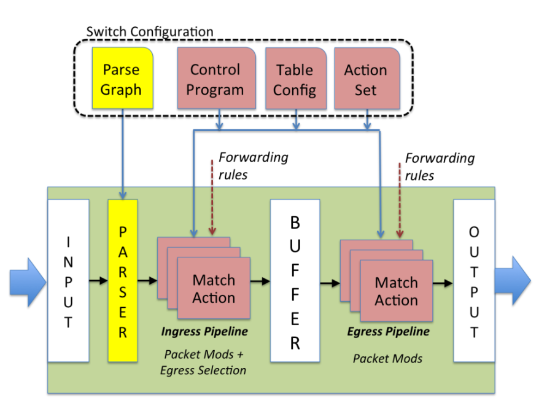

# 第4章：进阶语法-数据面处理

## 

在掌握了 NPC++ 的基础语法构建块之后，我们现在的任务是将这些组件组装成一个有机的整体。本章将深入剖析数据面的核心机制——**报文处理流水线**。

在 NPC++ 的架构中，数据包的处理并非杂乱无章，而是遵循着一条严谨的单向流水线。从物理端口接收信号到最终发出的全过程，可以高度概括为“**解析—处理—重组**”三个核心阶段。

**1. 解析阶段（Parser）：从比特流到结构体**

当数据包进入 NPC 模块时，它最初只是一串连续的、无结构的字节流（Bitstream）。解析器的任务是依据开发者定义的 NPCHeader 模板，从这串字节流中精确地识别并提取出关键信息（如 MAC 地址、IP 头、TCP 端口）。这一过程就像是一把精细的手术刀，将原始数据“切分”并映射为代码中可操作的结构体字段。

**2. Ingress阶段：匹配动作**

解析完成后，结构化的数据进入控制流（Control Flow）。这是业务逻辑的主战场，遵循“**匹配-动作**”模型：

- **匹配（Match）**：系统根据报文头部的关键字段（Key），在预定义的表（Table）中查找规则。
- **动作（Action）**：一旦匹配成功，即执行对应的函数逻辑（Function）。这可能包括修改报文内容（如 NAT 地址转换）、更新元数据（如设置出端口）、计数统计，甚至是直接丢弃报文（Drop）。

**3.Egress阶段：重组**

当所有的处理逻辑执行完毕后，报文处于一种分散的结构体状态。此时需要进入**重组器（Deparser）**，它执行与解析器相反的操作：将修改后的字段重新序列化，拼接成符合网络协议规范的二进制流，最终通过物理接口发送至网络链路。

TODO（）：这个图需要换成中文的



## **4.1 parser模块：提取协议头**

parser描述了具有一个数据报文从刚进入交换机入口状态到一个最终accept 状态的有限状态机。入口状态通过NPCProgram第一个参数指定，最终状态固定命名为accept，并链接到匹配动作入口点（表示解析成功）。入口状态是parser的一部分，而accept状态在逻辑上是parser的出口。

parser生成Match-Action（table- function）阶段操作的协议头，这个过程被称为报文解析。它是报文有效的协议头实例的集合。parser生成初始的协议头描述信息，table-function可以通过修改协议头实例的值和标记，从而达到更新报文的目的。

```cpp
//其次是解析器模块，解析以太头和ipv4头，属于两个C函数，注意前面表明该功能是@parser

@parser void ParseEthernet()  //解析提取以太网头部
{
    _extract(ethHdr);
    return switch(ethHdr.EtherType)
    {
        case ETHERTYPE_IPV4:
            ParseIpv4;
        default:
            accept;
    }
}

@parser void ParseIpv4() //解析提取ipv4头部
{
    _extract(ipv4Hdr);
    return accept;
}
```

### **parser基本概念与声明**

在 NPC++ 中，parser 负责从报文的第一个字节开始解析协议头部。每个 parser 包含多个状态，每个状态由一个 parser 函数表示。parser状态有一个名称和一个主体。

每个 parser 状态以 return 语句结束，用于指示下一个要执行的状态。最终，当状态跳转到 accept 时，解析流程结束，进入后续 control或者table 阶段。

### **Parser的工作流程**

解析器从报文偏移量 0 开始，并维护一个指向当前待处理字节的指针。调用 _extract 后：

1. 指定长度的报文内容被从原始数据报文复制至 NPCHeader（NPCHeader是最初定义的结构体，包括相对应的数据报文的头部字段，长度大小是一一对应的）
2. 该 header 被标记为“有效”
3. 偏移量向前移动相应长度
4. 根据 return 的状态表达式，跳转到下一个状态

parser 在做状态判断时，既可以基于报文字段内容，也可以基于其他元数据（如 ingress port、loopback 标记等），以支持不同场景下的解析需求。

### **状态跳转与return表达式**

NPC++ parser 通过 return 指定下一状态。return 可以直接跳转，也可以使用 switch 根据字段值选择状态。

```cpp
示例：

return parse_ipv4;

return accept;

return switch(ethernet.ethertype) { ... };
```

parser 的 switch 与 C 语言不同，其特点包括：

- case 必须是已经定义的常量
- 自上而下匹配，第一条命中即返回
- default 之后的 case 不可达，编译器会发出警告

switch 常用于协议分支判断，如根据 Ethertype 或 IPv4 协议号决定下一层解析状态

### **报文头部提取：_extract**

NPC++ 提供 _extract 用于从数据报文中读取协议头部数据：

void _extract(T headerLvalue, uint<8> length);

功能：

- 从当前偏移位置复制报文内容到 NPCHeader
- 设置 header 的有效位
- 移动报文偏移位置
- 可选 length 参数用于处理可变长度字段（如 IPv4 Option）

### **报文前视：_lookahead**

void _lookahead(T headerLvalue);

作用：

- 从当前偏移位置读取数据但不改变偏移量，就是查看当前位置往后的数据具体是什么内容，一般用的较少
- 不会更改NPCHeader里的字段内容
- 适用于提前检查后续字段类型，如 TCP Option Kind

### **整体使用示例**

```cpp
// 定义报文头部类型
NPCHeader<Ethernet_S> ethernet;
NPCHeader<Vlan_S>     vlan;
NPCHeader<Ipv4_S>     ipv4;
NPCHeader<Ipv4Option_S> ipv4_option;
NPCHeader<Tcp_S>      tcp;
NPCHeader<TcpOption_S> tcp_option;

// 入口状态：解析以太网
@parser void parse_ethernet() {
    _extract(ethernet);

    return switch(ethernet.ethertype) {
        case 0x8100: parse_vlan;
        case 0x0800: parse_ipv4;
        default: accept;
    };
}

// 解析 VLAN
@parser void parse_vlan() {
    _extract(vlan);

    return switch(vlan.ethertype) {
        case 0x0800: parse_ipv4;
        default: accept;
    };
}

// 解析 IPv4（包含可变长度 Option）
@parser void parse_ipv4() {
    _extract(ipv4);

    uint<8> hdr_len = ipv4.ihl << 2;
    uint<8> opt_len = hdr_len - (sizeof(ipv4) >> 3);
    if (opt_len > 0) {
        _extract(ipv4_option, opt_len);  // 提取可变长度字段
    }

    return switch(ipv4.proto) {
        case 6  & 0xff: parse_tcp;    // TCP
        case 17 & 0xff: accept;       // UDP（本例不展开）
        default: accept;
    };
}

// 解析 TCP（示例演示 lookahead）
@parser void parse_tcp() {
    _extract(tcp);

    _lookahead(tcp_option);           // 前视 TCP Option Kind

    return switch(tcp_option.data) {
        case 0 & 0xff: parse_tcp_opt_0;
        case 1 & 0xff: parse_tcp_opt_1;
        case 2 & 0xff: parse_tcp_opt_2;
        default: accept;
    };
}

@parser void parse_tcp_opt_0() {
    return accept;
}
```

## **4.2 Table模块，匹配功能**

Table是NPC++里声明的一个特定数据结构，由结构体构成，里面包括匹配关键字Key，根据匹配到的Key执行的相关增删改查操作，将匹配到的结果传入到Function，由Function执行更改NPCHeader的操作：

- 构造查表Key。
- 执行预定义的表操作，包括"查找、带索引返回的查找（在EM表中使用）、插入、读取、删除、写入”。预定义操作的结果将自动关联到绑定的function方法中。
- 传入结果到function，调用function。

一个table作为一个逻辑表，会映射到交换机的内存或者寄存器上，表项里的内容（Key和表操作）通过一个单独的控制平面API进行更改。

标准table包括以下属性：

- key：一个表达式，描述用于查找的key是由哪些信息构成的。
- 内置函数：识别查表类型。
- actions：即内置函数根据key匹配成功后对function函数调用
- size：此table所需的条目数。编译器将依据此属性来分配物理空间。

### **4.2.1. Table 属性**

Table 是一种逻辑表结构，用于映射硬件资源。它通过以下核心属性定义其行为：

- **key**: 定义查找键。由 { 表达式 : table_kind }组对构成。
- table_kind决定匹配类型，包括：
    - exact: 精确匹配表
    - ternary: 三态匹配表
    - lpm: 最长前缀匹配表
    - index: 索引匹配表
- **actions**: 定义操作与 Function 的绑定。使用 { 内置函数 : Function }格式，指明调用某个内置函数（如 _lookup）后，应自动触发哪个 Function（如 IpatFunction）。
- **size**: 定义表的条目数。编译器依据此属性分配物理空间。

```cpp
// 示例：展示 key, actions, 和 size 属性
table IPAT_T()
{
    // 1. key 属性：使用 InChannel 作为 index 类型
    key = {
        controlFlowMd.InChannel : index;  //冒号前面是数据包对应的字段，后面是匹配的类型
                               //即如果InChannel按Index匹配成功了Table里的Key，则执行后面的action
    }
    // 声明内置函数（详见板块 2）
    IPAT_RSP_S  _lookup();
    // 2. actions 属性：将 _lookup 操作绑定到 IpatFunction
    actions = {
        _lookup : IpatFunction();
    }
    // 3. size 属性：指定表大小
    size = IPAT_SIZE;
}
// IpatFunction 的定义（详见板块 3）
void IpatFunction(IPAT_RSP_S rsp) { ... }
```

### **4.2.2 内置函数**

内置函数是编译器预定义的、用于抽象 Table 硬件操作的方法，它们在 table 结构内部声明，以定义该表支持的操作。相关内置函数的定义，基于英文的直译名称，请查看附录。

- **_lookup()**: 查找操作。隐式使用 key属性作为输入，返回查表结果（RSP_S）。
- **_insert(RSP_S response)**: 插入操作（仅限 exact表）。隐式使用 key，response是要插入的内容。
- **_delete(op_type, index)**: 删除操作（仅限 exact表）。
    - op_type = 0: 按 key删除。
    - op_type = 1: 按 index删除。
- **_write(RSP_S Rsp, TEST_COND)**: 重写操作。隐式使用 key作为索引，Rsp是写入内容，TEST_COND 是可选的写入条件。
- **_status()**: 状态获取。在 actions绑定的 Function 内部使用，返回前一个操作的状态（如 TBL_LOOKUP_HIT或 TBL_LOOKUP_MISS）。

```cpp
// 示例：在一个表定义中声明多种操作
table DATA_PLANE_TBL () {
    key = {
        IPv4.DstAddr : lpm;
        IPv4.Proto   : exact;
    }

    // 1. 声明 _lookup
    RSP_S     _lookup();

    // 2. 声明 _insert (假设key也用于exact表)
    uint<16>  _insert(RSP_S response);

    // 3. 声明 _delete
    uint<16>  _delete(const uint<1> op_type, uint<16> index);

    // 4. 声明 _write (假设用于线性表)
    void      _write(RSP_S Rsp);

    // ( _status() 函数在绑定的 Function 中使用，不在表内声明为操作)

    actions = {
        _lookup : lookup_func();
        _insert : insert_func();
        _delete : delete_func();
        _write  : write_func();
    }
    size = 1024;
}
```

### **4.2.3 Function 的定义与绑定**

Function 用于处理内置函数（如查表）返回的结果。Table 框架通过 actions 属性将两者绑定，实现“查表 -> 处理”的流水线。

**1.绑定 (Actions)**: 在 table 内部使用 actions 属性完成绑定。

**2.定义 (Definition)**: Function 在 table 外部定义，如同标准函数。

**3.参数 (Parameters)**: Function 的入参 **接收** 内置函数的*输出*。

- _lookup绑定的 Function，入参是查表结果 RSP_S。
- _insert绑定的 Function，入参是插入的索引 Index（如果定义了）。

**4.调用 (Invocation)**: 当代码调用 TableVar._lookup() 时，硬件执行查找，并自动触发绑定的 Function（如 IpatFunction(RSP_S rsp)）。

**5.状态获取**: 在 Function 内部，可以调用 _status() 获取操作结果（如命中/未命中）。

```cpp
示例：
// 1. 定义 Table 并通过 actions 绑定
table IPAT_T()
{
    key = { controlFlowMd.InChannel : index; }

    IPAT_RSP_S  _lookup(); // _lookup 的输出是 IPAT_RSP_S

    // 绑定：_lookup 操作触发 IpatFunction
    actions = {
        _lookup : IpatFunction();
    }
    size = IPAT_SIZE;
}

// 2. 定义 Function (IpatFunction)
//    Function 的入参 (rsp) 接收 _lookup 的输出
void IpatFunction(IPAT_RSP_S rsp)
{
    // 3. 在 Function 内使用 _status() 获取状态
    STATUS_S lookup_status = _status();

    // 根据状态或结果内容 (rsp.ValidFlag) 进行处理
    if(lookup_status.hit == TBL_LOOKUP_MISS) { // 假设 TBL_LOOKUP_MISS
        npc_pkt_drop();
        npc_exit();
    }

    // 使用查表结果
    ethHdr.SrcMac = rsp.MacAddr;
    controlFlowMd.VrfId = rsp.VrfId;
}

// 4. 调用
// 实例化 Table
IPAT_T my_ipat_table;

// 调用内置函数，这将自动触发上面绑定的 IpatFunction
my_ipat_table._lookup();

```

## **4.3 实现数据控制流**

### **4.3.1 控制流、Function 与 Table 调用**

控制流（Control Flow）通过 @control 函数来表示，它定义了以何种顺序查找 Table 或执行 Function。在一个 @control 函数中：

- **实例化 Table**: Table 在使用前必须实例化（类似 C++ 类）。每个实例都会映射到独立的硬件资源。
- **调用 Table 方法** : 在 Table 实例上调用其内置函数（如 _lookup, _write）。
- **定义 Function**: 在全局作用域内定义 void返回的辅助函数。
- **调用 Function** : 显式调用其他辅助函数或 @control函数。所有参数均通过引用传递，调用时函数会被内联。

通过table和function实现基本的数据控制流。

```cpp
// 1. Table 实例化 
// (假设这些 Table 类型已在别处定义)
AGGREGATOR_INDEX_TBL  agg_tbl;
BITMAP_TBL            bitmap_reg;
ECN_TBL               eng_reg;

// 2. Function 定义 
// 定义一个辅助函数 (void 类型, 全局作用域)
// (atp_meta 假设为全局变量或传入参数)
void clean_tables() {
    //  3. 调用 Table 成员函数 
    // 在 Table 实例上调用方法
    agg_tbl._delete(DELETE_BY_INDEX, atp_meta.em_index);
    bitmap_reg._write(0);
    eng_reg._write(0); 
    
    uint<32> value;
    npc_counter_read_clr(agg_counter[atp_meta.em_index], value) ;
}

// 4. 主控制流函数 
@control void ControlFlow()
{
    controlFlowMd.InChannel = npc_intrinsic_metadata.InSubChan[7:0];
    
    // 实例化一个 Table 
    IPAT_T ipat = IPAT_T();
    // 调用 Table 方法 
    IPAT_RSP_S ipatRsp = ipat._lookup();
    
    if (npc_pkt_get_valid(vlan1Hdr) == 1) {
        // 5. 显式调用 Function 
        // 在 ControlFlow 中调用另一个辅助函数
        clean_tables();
    }
    
    // ... 其他逻辑 ...
}
```

### **4.3.2 NPCProgram 程序定义与线程**

NPCProgram 用于声明程序的入口线程，它将一个或多个控制流（Control Flow）函数与解析器（Parser）绑定。

- **Main 线程**: 线程名为 main，是设备加载 App 后的主程序入口，用于处理数据报文。
- **背景线程** : 线程名**非**main（例如 bgpacketgen），用于处理定时任务。
- 背景线程通常包含 do-while(1)循环，并使用 npc_time_timer()进行定时。
- 可通过 npc_exit()退出线程。
- **背景线程部署（参考控制面接口使用，暂不做深入学习，可参考例子直接使用）** :
    - **配置**: 编译器通过 perf_conf.json配置部署份数（"bgName", "number"）。
    - **控制**: 通过 HAL API (如 HAL_OAS_StartBackgroundTask) 启停。建议使用 NPCRegister作为控制面联动机，以确保 App 可独立重启。
    - **多段解析** : 当报文超过 128B 时，NPCProgram可以定义一个 (Parser, Control) 对的序列，分段进行解析。全局变量可共享，但解析出的 Header 仅在紧邻的 Control 块中可见。

```cpp
// 1. Main 线程定义 
@parser ParseEthernet() { /*...*/ }
@control void ControlFlow() { /*...*/ }

// 将 ControlFlow 绑定到 main 线程
NPCProgram(ParseEthernet(), ControlFlow()) main;

//  2. 背景线程定义
// (用于定时任务，如数据包生成)

// 用于控制面联动，确保线程可被安全停止
NPCRegister<uint<32>> controlSignal0; 

@control void BgThPacketGen() {
    do {
        // 检查控制信号
        if (controlSignal0[0:0] == 0) {
            // 7.5.1: 执行背景任务
            npc_pkt_new();
            npc_pkt_add_sys_hdr();
            // ... (npc_pkt_add, npc_pkt_send) ...
            npc_time_timer(TIMER_MODE_S, 1); // 定时
        } else {
            npc_exit(); // 退出线程
        }
    } while (1); //常驻线程
}

// 将 BgThPacketGen 绑定到名为 'bgpacketgen' 的背景线程
NPCProgram(NULL, BgThPacketGen()) bgpacketgen;

/* *  部署配置 (perf_conf.json)
 * { "bgThreadInfo" : [ { "bgName" : "bgpacketgen", "number" : 2 } ] }
 *
 * 启动 API
 * HAL_OAS_StartBackgroundTask(feId, "bgpacketgen");
 */

//  3. 多段解析定义  
// (用于 > 128B 的报文)
@parser ParseFirstPart() { /*...*/ }
@control ControlFlow() { /*...*/ }
@parser ParseSecondPart() { /*...*/ }
@control ControlSimpleJustSavePktData2GV() { /*...*/ }
@parser ParseLastPart() { /*...*/ }
@control ControlForDPI() { /*...*/ }

// 定义一个包含三段 (Parser, Control) 序列的 main 线程
NPCProgram(ParseFirstPart(), ControlFlow(), 
           ParseSecondPart(), ControlSimpleJustSavePktData2GV(), 
           ParseLastPart(), ControlForDPI()) main_multi_segment;
```

## **4.4 deparser构造报文**

parser的逆过程是deparser，也就是报文构造。

**使用deparser构建输出报文**

```cpp
//
@control void ControlFlow()
{
    g_ctrlMd.InChnnl = npc_intrinsic_metadata.InSubChan[7:0];
    //匹配表项，查找目的mac地址，如果mac地址不对，则丢弃
    //IPAT_RSP_S 这个代表要写入的内容，即匹配成功后将内容写入到对应变量，后续带RSP_S的均为写入
    IPAT_RSP_S ipatRsp = ipat._lookup();
    if (ipatRsp.Mac[47:32] != ethHdr.DstMac[47:32] || ipatRsp.Mac[31:0] != ethHdr.DstMac[31:0]) {
        npc_pkt_drop();
        npc_exit();
    }
    //获取匹配到的VrfId和Dip，接着匹配
    g_flowKey.VrfId = ipatRsp.VrfId;
    g_flowKey.Dip = ipv4Hdr.Dip;
    
    //如果匹配成功，获取出端口 
    LPM_RSP_S rsp = fibv4._lookup();
    g_ctrlMd.OutChnnl = rsp.idx;
    
    //依照出端口获取到对应的mac地址
    EPAT_RSP_S epatRsp = epat._lookup();
    
    //重新封装数据包的mac地址
    ethHdr.DstMac = rsp.DstMac;
    ethHdr.SrcMac = epatRsp.Mac;
    //发送数据包
    npc_pkt_add_sys_hdr(); //将之前的Eth和Ipv4这些数据报文都有的头部重新装填
    npc_pkt_deparser();  //构造报文
    npc_pkt_send(); //发送报文
    npc_exit();
}
```

**报文丟弃**

NPC++支持两种丢弃处理包。

在控制流的任意部分直接调用npc_pkt_drop() 函数。

**报文复制**

单次复制，复制一份原始报文，从指定的出端口发送，在npc_pkt_replicate 前的编辑作用于该报文。复制后的报文继续在当前线程中完成后续处理。示例代码如下：

```cpp
intrinsic_output. metadata.OutsubChan = 0; //指定原始报文A的出接口。

npc_pkt_replicate();     //复制原始报文并发送报文A。

intrinsic_output_metadata. OutSubChan = 1;//指定复制报文B的出接口。

ipv4Hdr.DstAddr = 0xc6a80001;   //修改复制报文B的目的IP地址。

ethHdr.DstMac = 0x101112131415;  //修改复制报文B的目的MAC地址。

npc_pkt_send ();      //发送报文B
```